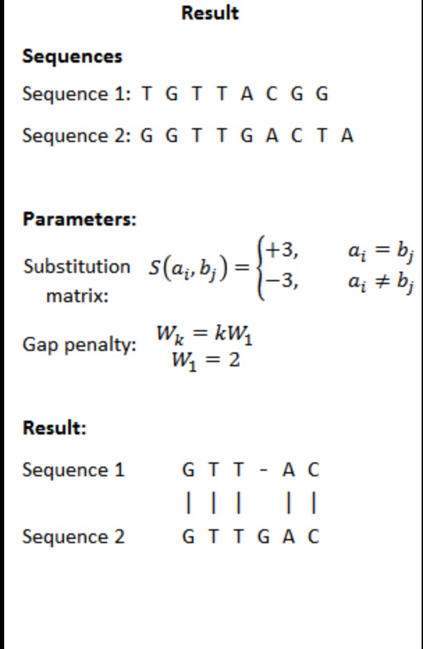
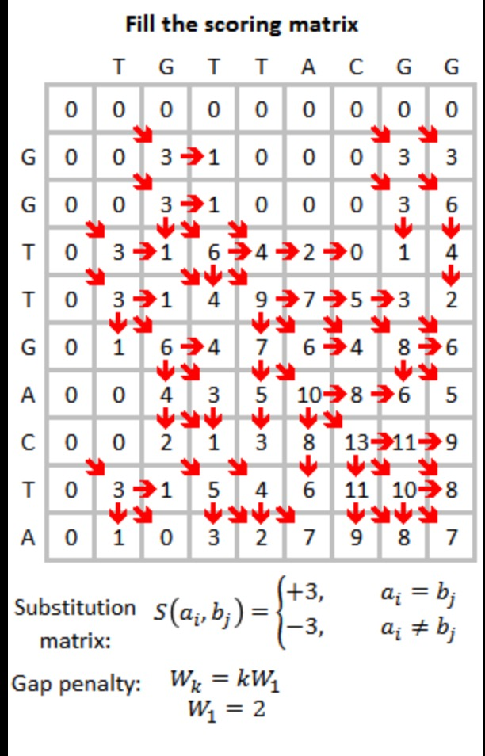

# Smith-Waterman
生物信息 Smith-Waterman 局部优化比对算法编程实现

## 基本思想
由于全局最优比对有时会淹没局部相似性     
Smith-Waterman 改进了 Needleman-Wunsch算法,提出序列局部比对算法

改进的关键在于 ： 不计较s序列前缀和后缀的得分    
          
通过修改得分矩阵初始化形式:       
不计前缀s[0,i]的得分 - 处理第一行（置0）        
不计删除后缀s[j+1,n]的得分 - 处理最后一行 （最后一行删除不计得分）         

## 算法过程

## 动态规划过程

### 软件截图

